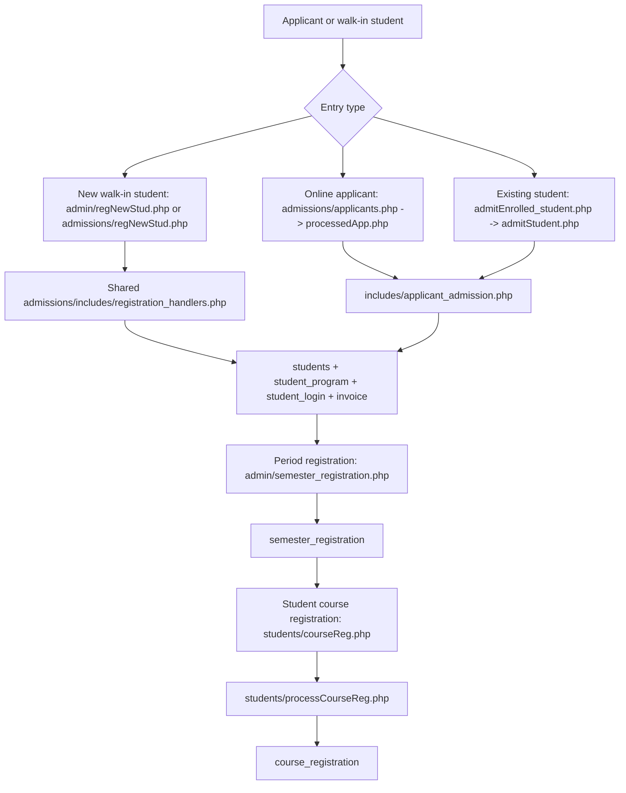

# Registration Workflow Map

Last updated: 2026-06-18.

This map describes the current WUC Portal student registration workflow across
admin, admissions, and student-facing pages.

## Canonical Flow

## Admission Paths

All admin and admissions new-student entry points must use the shared
registration UI and handlers:

- `admin/regNewStud.php`
- `admissions/regNewStud.php`
- `admissions/includes/registration_bootstrap.php`
- `admissions/includes/registration_ajax.php`
- `admissions/includes/registration_panel.php`
- `admissions/includes/registration_handlers.php`

Deprecated admin entry points redirect to the shared wizard:

- `admin/add_student.php`
- `admin/register_student.php`

Existing-student admission and processed-applicant conversion should route
through `includes/applicant_admission.php` so they create the same business
records as a new manual registration.

## Period Registration

The canonical admin page is:

- `admin/semester_registration.php`

This page creates the `semester_registration` row after a student already has an
active `student_program` enrolment. It supports both `semester` and `term`
programs using `programs.period_mode`.

Legacy admin links to `admin/semesterReg.php` should be treated as old bookmarks.
That page redirects to `admin/semester_registration.php`.

## Business Rules

- A student must have an active `student_program` row for the selected program
  before period registration is allowed.
- `programs.period_mode` controls the period type:
  - `semester`: period numbers 1-2
  - `term`: period numbers 1-3
- Duplicate period registration is checked by student, program, period type,
  period number, year of study, and academic year.
- New-student registration must create:
  - `students`
  - `student_program`
  - `student_login`
  - initial invoice when applicable
- Student course registration uses the latest/current `semester_registration`
  context and then writes child rows to `course_registration`.

## Architecture Notes

- Registration remains legacy PHP/MySQL; there is no root Laravel app.
- Shared helpers adapt to schema drift through table and column discovery rather
  than forcing migrations.
- Admission creation uses `mysqli` transactions. Keep new writes in the same
  transaction when extending the flow.
- Avoid adding new registration entry pages. Add links to the canonical pages
  above instead.

## Open Follow-Up

Student-facing legacy pages named `students/semesterReg.php` and
`students/completeReg.php` still exist and post to the student-side registration
flow. They were not changed by this admin/admissions consistency pass.
